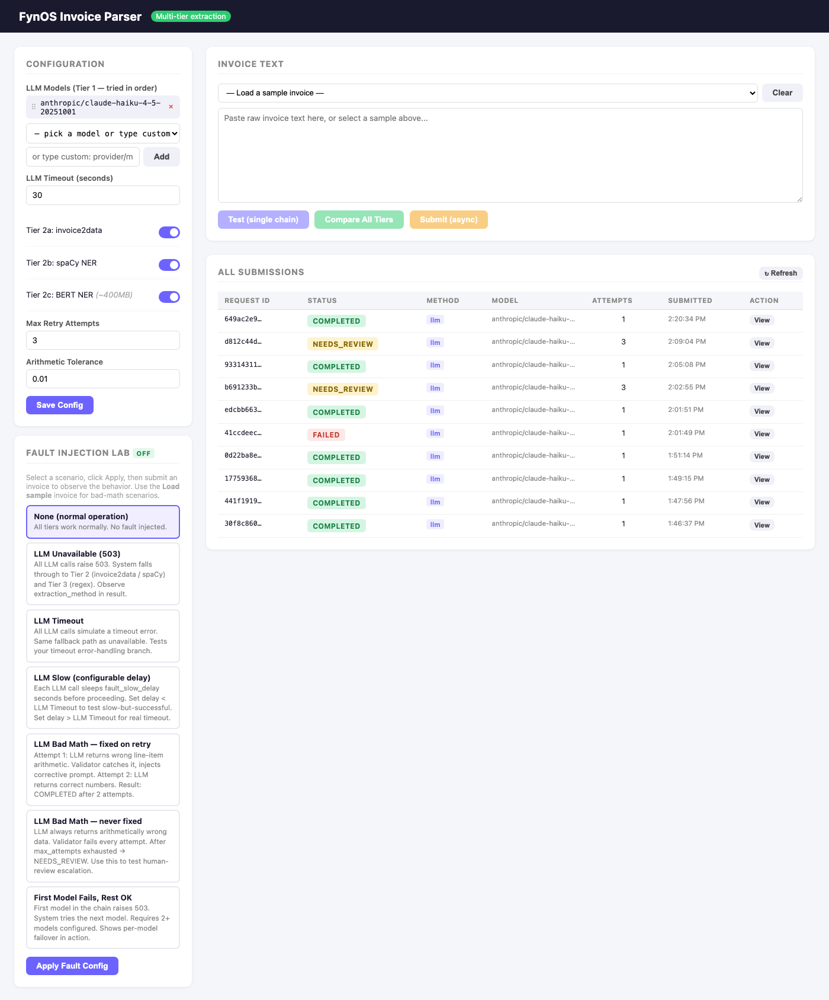
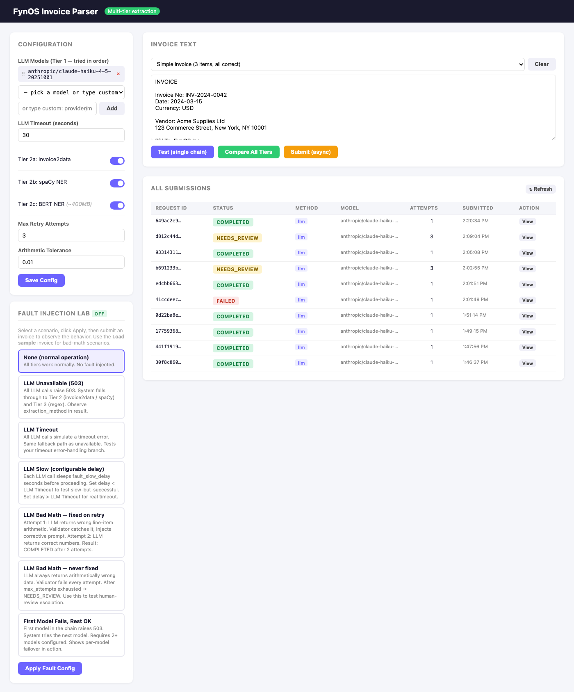
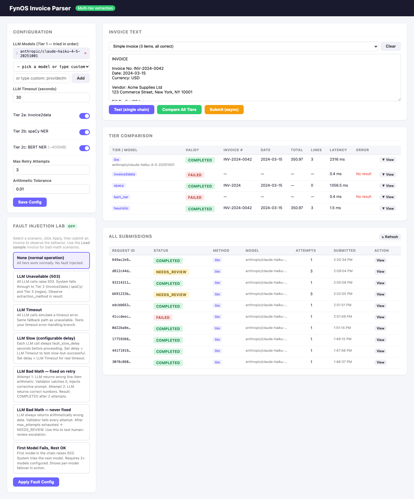
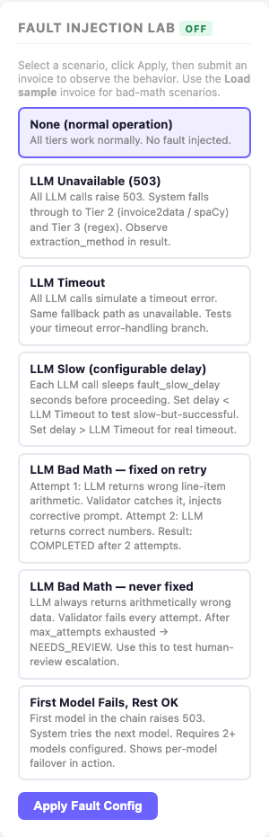
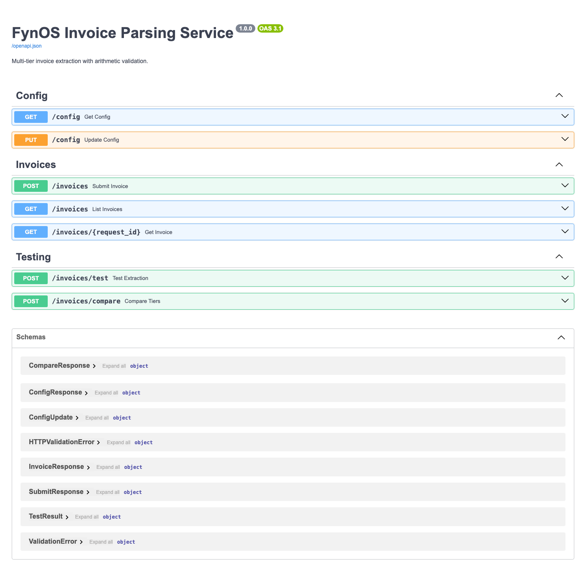

# FynOS Invoice Parsing Service

> **→ [Full Design Document](DESIGN.md)** — deep-dive into architecture decisions, flows, and prompt engineering.

---

## Demo

[Demo Video](https://drive.google.com/file/d/1f9KMQHHnfMGe4aEhRouBhJp4gNrTExW3/view?usp=sharing)

---

## What This Is

A small HTTP service that takes raw invoice text (as you'd get from OCR), extracts structured financial data from it, checks that the numbers add up, and gives you the result via a simple polling API.

**The core loop in plain English:**
1. You POST the invoice text → get back a `request_id` immediately
2. The service runs extraction in the background
3. You poll `GET /invoices/{id}` until the status is terminal
4. You get back structured JSON with line items, totals, and a validation report

---

## The Problem & How We Thought About It

### What can go wrong with invoice parsing?

Before writing any code, we mapped out the failure modes:

- **LLMs hallucinate numbers.** An LLM can return syntactically valid JSON with a total that doesn't match the line items. This is dangerous in a financial context — a wrong number that *looks* right is worse than no number at all.
- **LLMs go down.** Rate limits, outages, and cost caps are real. If the LLM is the only extraction path, every invoice fails when it's unavailable.
- **Invoices vary wildly.** European decimal formats (`1.234,56`), missing fields, tabular vs. narrative layouts, partial OCR quality — a single extractor won't handle all of these well.
- **Clients retry.** A client that times out before receiving the 202 will resend. Without careful deduplication, the same invoice gets processed twice — a serious problem in accounting.

### Our approach

These failure modes led to three core design decisions:

**1. Multi-tier extraction** — don't depend on any single extractor. Try a capable LLM first. If it's unavailable, fall through to deterministic tools (invoice2data, spaCy). If those fail, a regex heuristic always runs. The service *always* produces something from a parseable invoice, even with no API keys configured.

**2. Arithmetic validation as a first-class concern** — every extraction result (regardless of which tier produced it) goes through the same validation engine before being marked `COMPLETED`. If numbers don't add up, we tell the LLM exactly what's wrong and ask it to re-extract. Only after passing validation (or exhausting retries) does the invoice reach a terminal state.

**3. Content-hash deduplication** — the same invoice text always hashes to the same key. Duplicate submissions and timeout-retries are handled transparently, without requiring the client to manage idempotency keys.

---

## How It Works

### The extraction pipeline

```
POST /invoices
      │
      ▼
  Dedup check (SHA-256 of text)
      │
      ├─ Already exists + not FAILED? → return existing request_id
      └─ New (or FAILED) → insert row, return 202, start BackgroundTask
                                │
                        ┌───────▼────────┐
                        │    PENDING     │
                        └───────┬────────┘
                                │
                  ┌─────────────▼──────────────────┐
                  │         VALIDATING              │
                  │                                 │
                  │  Try each tier in order:        │
                  │  Tier 1 → LLM (Claude/GPT/etc)  │
                  │  Tier 2 → invoice2data / spaCy  │
                  │  Tier 3 → Regex (always runs)   │
                  │                                 │
                  │  Then: arithmetic checks        │
                  │  qty × price = amount?          │
                  │  subtotal + tax = total?        │
                  └─────┬───────────────┬───────────┘
                        │               │
                  all pass          numbers wrong
                        │               │
                        ▼               ▼
                   COMPLETED     retry with corrective
                  (terminal)     prompt → VALIDATING
                                        │
                                  after max retries
                                        ▼
                                  NEEDS_REVIEW
                                  (terminal)
```

### Validation — why and how

We run three arithmetic checks after every extraction attempt:

| Check | What it verifies | Blocks completion? |
|---|---|---|
| Per-line | `qty × unit_price × (1 − discount%) ≈ amount` | Yes |
| Document total | `subtotal − discount + shipping + tax ≈ total` | Yes |
| Line-item sum | `Σ line amounts ≈ subtotal` | No (advisory only) |

The third check is advisory-only because long invoices are often partially extracted. If only 10 of 30 line items were found, the sum of those 10 won't match the subtotal — but that's expected, not an error.

When checks fail, the service builds a precise error message and injects it into the next LLM prompt:

```
Arithmetic errors found in your previous extraction.
Re-examine the source text and correct these values:

- Line item 0 ("Widget A"): qty×unit_price=50.00, reported amount=45.00 (Δ=5.00)
- Total: subtotal(100.00)+tax(10.00)=110.00, reported total=999.99 (Δ=889.99)

Return corrected JSON only. Do not add explanation.
```

The LLM sees the exact discrepancy and the original source text together — giving it the best chance to correct the mistake rather than fabricate new numbers.

### Crash recovery

If the process dies mid-extraction, rows can get stuck in `VALIDATING`. On every startup, the service moves any rows in that state older than 60 seconds to `FAILED`. No zombie rows, no manual cleanup.

---

## The 3 Idempotency Scenarios

Dedup key: `SHA-256(document_text.strip().lower())`

### Scenario 1: Deliberate duplicate — client submits the same invoice twice

The outcome depends on what state the first submission is in:

| Existing state | What happens | Why |
|---|---|---|
| `PENDING / VALIDATING` | Return the existing `request_id` (`duplicate: true`) | It's already being processed — no point running it twice |
| `COMPLETED` | Return the existing result | Same invoice, same result — idempotent by design |
| `NEEDS_REVIEW` | Return the existing record | A human is already reviewing it — don't create a duplicate ticket |
| `FAILED` | **Create a new record** | System failure, not a business duplicate — the resubmission is an intentional retry |

In accounting, processing the same invoice twice is far worse than returning a cached result. We always err toward deduplication.

### Scenario 2: Client timeout — never received the first 202, resends

Content-hash dedup handles this automatically. The second POST finds the in-flight record and returns its `request_id`. The client can immediately start polling — it gets the same request ID as if the first response had arrived.

### Scenario 3: D-4471 fails, client immediately resubmits the same document

`D-4471` is `FAILED`. The new POST creates a fresh `request_id`. Two things happen:
- The new record processes normally → `COMPLETED`
- The old `FAILED` record stays as an audit trail: *what failed, when, and why*

We treat `FAILED` as a clean-slate retry rather than a duplicate because the failure was a system error (LLM down, all tiers exhausted), not a business duplicate. Overwriting the failed record would destroy the evidence.

---

## Project Structure

```
invoice-parser/
├── app/
│   ├── main.py          # FastAPI routes — submit, poll, config, test, compare
│   ├── processor.py     # State machine — PENDING → VALIDATING → terminal
│   ├── extractor.py     # All 4 extraction tiers + orchestrator
│   ├── validator.py     # Arithmetic checks — independent of extraction method
│   ├── models.py        # Pydantic schemas + number coercion
│   ├── database.py      # SQLite CRUD + startup recovery
│   ├── config.py        # Settings (env vars + runtime-mutable via PUT /config)
│   ├── fault_injection.py  # Test modes: LLM unavailable, bad math, slow, etc.
│   └── static/
│       └── index.html   # Single-page UI (Alpine.js, no build step)
├── templates/
│   └── generic.yml      # invoice2data YAML template
├── tests/
│   ├── test_validator.py
│   └── test_extractor.py
├── docs/screenshots/    # UI screenshots
├── README.md
└── DESIGN.md            # Full design rationale and flows
```

---

## Quick Start

```bash
# 1. Clone and enter
cd invoice-parser

# 2. Virtual environment
python -m venv .venv && source .venv/bin/activate

# 3. Install dependencies
pip install -r requirements.txt

# 4. Optional: download spaCy model (improves Tier 2b extraction)
python -m spacy download en_core_web_sm

# 5. Configure
cp .env.example .env
# Open .env and add an API key, or leave as-is to use the regex heuristic only

# 6. Start
uvicorn app.main:app --reload
```

| URL | What's there |
|---|---|
| `http://localhost:8000` | Interactive UI (test, compare, fault injection) |
| `http://localhost:8000/docs` | Swagger / OpenAPI spec |

**No API key needed to run.** Without any key, Tier 1 (LLM) is skipped and the service falls through to invoice2data → spaCy → regex. You'll still get useful extractions from well-structured invoices.

**Free LLM options:**
- **Groq** — `groq/llama-3.3-70b-versatile` — free, no credit card (console.groq.com → set `GROQ_API_KEY`)
- **Cerebras** — `cerebras/llama-4-scout-17b-16e-instruct` — 1M tokens/day free (inference.cerebras.ai)
- **Ollama** — `ollama/qwen2.5:14b` — fully local, `ollama serve` first, no key needed

---

## UI Walkthrough



The UI has five panels:

**Left column:**
- **Configuration** — set which LLM models to use (in priority order), toggle Tier 2 extractors, adjust retry count and arithmetic tolerance. Saved via `PUT /config`, takes effect immediately.
- **Fault Injection Lab** — activate failure modes to observe fallback/retry behavior without needing an actual outage.

**Right column:**
- **Invoice Text** — paste any invoice or load a built-in sample. Three buttons: *Test* (submits and polls until done), *Compare All Tiers* (runs all extractors in parallel), *Submit (async)* (fires and returns the request_id for manual polling).
- **Results panels** — show extracted fields, line items, validation checks, latency, and which tier/model was used.
- **All Submissions** — history table with status badges and a detail drawer.









---

## Data Model

### States and transitions

```
PENDING → VALIDATING → COMPLETED      ← terminal, success
               │
               ├─ (retry < max) → VALIDATING  ← loop with corrective prompt
               └─ (retry = max) → NEEDS_REVIEW ← terminal, human needed

PENDING → FAILED    ← terminal, all tiers failed or critically empty result
VALIDATING → FAILED ← terminal, unexpected system error mid-attempt
```

| State | Meaning |
|---|---|
| `PENDING` | Accepted, queued |
| `VALIDATING` | Extraction running + arithmetic checks (both phases share this state) |
| `COMPLETED` | Done, numbers verified |
| `NEEDS_REVIEW` | Extracted data has persistent arithmetic errors — needs human review |
| `FAILED` | All extractors failed, critically empty result, or unrecoverable system error |

### Extracted invoice schema

```
InvoiceExtraction
├── invoice_number    string or null
├── invoice_date      string (YYYY-MM-DD) or null
├── currency          string (ISO 4217: USD, EUR, GBP…) or null
├── vendor_name       string or null
├── subtotal          number or null   ← pre-discount, pre-shipping sum
├── discount          number or null   ← document-level discount (positive)
├── shipping          number or null
├── tax_total         number or null
├── total             number or null
└── line_items[]
    ├── description       string or null
    ├── quantity          number or null
    ├── unit_price        number or null
    ├── discount_percent  number or null  (e.g. 10 = 10% off)
    └── amount            number or null
```

All numeric fields handle US format (`1,000.00`), European format (`1.000,50`), and currency prefixes (`$100`) automatically.

### Database schema (SQLite)

```sql
CREATE TABLE invoices (
    request_id        TEXT PRIMARY KEY,     -- UUID v4
    content_hash      TEXT NOT NULL,        -- SHA-256(text.strip().lower())
    document_text     TEXT NOT NULL,
    status            TEXT NOT NULL DEFAULT 'PENDING',
    attempt_count     INTEGER NOT NULL DEFAULT 0,
    extraction_method TEXT,   -- llm | invoice2data | spacy | bert_ner | heuristic
    extraction_model  TEXT,   -- e.g. groq/llama-3.3-70b-versatile (null for non-LLM)
    result            TEXT,   -- JSON blob: InvoiceExtraction
    validation_checks TEXT,   -- JSON blob: per-check pass/fail + deltas
    error             TEXT,
    created_at        TEXT NOT NULL,  -- ISO-8601 UTC
    updated_at        TEXT NOT NULL
);
```

---

## API Reference

### POST /invoices — submit invoice for async extraction

```
POST /invoices
Content-Type: application/json

{ "document_text": "INVOICE #1234\nDate: 2024-01-15\n..." }
```

Also accepts `Content-Type: text/plain` with raw text as the body.

**202 response:**
```json
{ "request_id": "550e8400-...", "status": "PENDING", "duplicate": false }
```

If the same invoice was already submitted: `"duplicate": true` and `status` reflects the existing record's current state.

---

### GET /invoices/{request_id} — poll for result

```
GET /invoices/550e8400-e29b-41d4-a716-446655440000
```

**200 response (COMPLETED):**
```json
{
  "request_id": "550e8400-...",
  "status": "COMPLETED",
  "attempt_count": 1,
  "extraction_method": "llm",
  "extraction_model": "groq/llama-3.3-70b-versatile",
  "result": {
    "invoice_number": "INV-1234",
    "invoice_date": "2024-01-15",
    "currency": "USD",
    "vendor_name": "Acme Corp",
    "subtotal": 100.00,
    "discount": null,
    "shipping": null,
    "tax_total": 10.00,
    "total": 110.00,
    "line_items": [
      { "description": "Widget A", "quantity": 2.0, "unit_price": 50.00, "discount_percent": null, "amount": 100.00 }
    ]
  },
  "validation_checks": {
    "all_passed": true,
    "checks": [
      { "name": "line_item_0", "passed": true,  "expected": 100.0, "actual": 100.0, "delta": 0.0, "message": "line_item_0: OK" },
      { "name": "total",       "passed": true,  "expected": 110.0, "actual": 110.0, "delta": 0.0, "message": "total: OK" }
    ]
  },
  "error": null,
  "created_at": "2024-01-15T10:00:00Z",
  "updated_at": "2024-01-15T10:00:05Z"
}
```

Poll until `status` is `COMPLETED`, `NEEDS_REVIEW`, or `FAILED`. **404** if not found.

---

### GET /invoices — list recent submissions

```
GET /invoices?limit=50
```

Returns array of summaries (no `result` or `document_text` field). Newest first.

---

### GET /config — current configuration

```json
{
  "llm_models": ["groq/llama-3.3-70b-versatile"],
  "llm_timeout": 30,
  "enable_invoice2data": true,
  "enable_spacy": true,
  "enable_bert_ner": false,
  "max_attempts": 3,
  "tolerance": 0.01
}
```

### PUT /config — update configuration (live, no restart needed)

Send any subset of the fields above. Returns full updated config.

---

### POST /invoices/test — synchronous extraction (for UI/testing)

Same request as `POST /invoices`. Waits for terminal state and returns the full result inline, with `latency_ms`.

### POST /invoices/compare — run all tiers in parallel

Same request. Returns an array of results, one per enabled tier/model, useful for benchmarking.

---

## Configuration Reference

| Variable | Default | Description |
|---|---|---|
| `LLM_MODELS` | `anthropic/claude-haiku-4-5-20251001` | Comma-separated models, tried left-to-right |
| `ANTHROPIC_API_KEY` | — | Anthropic key |
| `OPENAI_API_KEY` | — | OpenAI key |
| `GROQ_API_KEY` | — | Groq key (free tier available) |
| `CEREBRAS_API_KEY` | — | Cerebras key (free tier available) |
| `ENABLE_INVOICE2DATA` | `true` | YAML template extractor |
| `ENABLE_SPACY` | `true` | spaCy EntityRuler |
| `ENABLE_BERT_NER` | `false` | BERT NER (~400 MB download on first use) |
| `MAX_ATTEMPTS` | `3` | Retry cycles before NEEDS_REVIEW |
| `LLM_TIMEOUT` | `30` | Seconds before LLM call times out |
| `TOLERANCE` | `0.01` | Arithmetic tolerance (1 cent) |
| `DATABASE_URL` | `./invoices.db` | SQLite path |

---

## Running Tests

```bash
pytest tests/ -v
```

Covers: arithmetic validation logic, tolerance edge cases, null skipping, number coercion (US/European/currency-prefix formats), regex extractor patterns, and API integration (submit, poll, dedup, config, compare).

---

## Trade-offs Made

| Decision | What we chose | What we gave up | Why it's fine here |
|---|---|---|---|
| Storage | SQLite | Postgres, horizontal scale | Zero setup; swap `_conn()` for production |
| SQLite access | Synchronous `sqlite3` | `aiosqlite` (non-blocking) | DB calls block the event loop under load — acceptable for single-process demo, not for production. Acknowledged, not ignored. |
| Job queue | FastAPI `BackgroundTasks` | Celery/BullMQ | No external infra; single-process is fine for the challenge scope |
| Tier 3 always-on | Regex heuristic | Cleaner "all or nothing" failure | Partial data beats total failure in accounting |
| Subtotal check advisory | Advisory only | Strict enforcement | Long invoices are always partially extracted; strict would produce false negatives |
| BERT NER off by default | Disabled | Better NER quality | 400 MB download disrupts demo setup; should be pre-warmed in production |

## With More Time

- Confidence score per field (high / medium / low) surfaced in the API response
- `PATCH /invoices/{id}/review` — human override to accept or correct a `NEEDS_REVIEW` record
- Per-vendor template learning: auto-generate invoice2data YAML from `COMPLETED` extractions
- `aiosqlite` to avoid blocking the event loop under load
- Structured JSON logging with per-attempt trace (model, tokens, latency)
- Docker + docker-compose with optional Ollama sidecar for fully offline operation
- Webhook/callback support so clients don't need to poll

---

## Known Gaps & Pending Work

The fault-tolerance logic is implemented and the code paths exist, but **exhaustive scenario testing is incomplete**. Here's what still needs coverage:

**Fault tolerance scenarios not fully tested end-to-end:**
- LLM unavailability (`503` / rate-limit) with all fallback tiers active simultaneously — the individual paths work, but the full cascade (Tier 1 fails → Tier 2a → Tier 2b → Tier 3 → COMPLETED via heuristic) hasn't been exercised under real network conditions
- Timeout behaviour at the boundary — what happens when `LLM_TIMEOUT` is set to exactly the latency of a slow model hasn't been stress-tested across providers
- Concurrent duplicate submissions racing to insert the same `content_hash` — the `UNIQUE` constraint handles it at the DB level, but the response behaviour under high concurrency hasn't been verified

**Backup / fallback models not yet validated:**
- The LLM chain is designed to try models left-to-right, but only the primary model (`claude-haiku` / `groq/llama-3.3-70b`) has been tested end-to-end. Secondary and tertiary models in the chain (Cerebras, Ollama local) have been configured and smoke-tested but not validated for extraction quality or failover correctness across real invoice samples
- BERT NER (`drajend9/bert-finetuned-ner-invoice`) has been integrated but not benchmarked against a representative invoice dataset — its quality relative to the other tiers is unknown

**What this means in practice:** the architecture handles these scenarios correctly by design (the state machine is sound, the dedup logic is correct, the fallback order is enforced in code), but the confidence level on the *quality* of results from fallback paths is lower than for the primary LLM path. A proper test suite covering all six fault modes against a labelled invoice dataset is the next priority.

---

## How We Built This (AI Tool Disclosure)

This submission was built with **heavy use of Claude Code** (Anthropic's AI coding assistant). Being explicit about what that means:

**What the AI did:**
- Brainstorming session — explored 3 architecture approaches before committing, with the AI surfacing trade-offs for each
- Parallel research agents — ran simultaneous lookups on free LLM APIs, invoice2data, spaCy, BERT NER models, and SQLite concurrency patterns
- Generated the initial code for all modules (extractor, validator, processor, database, API, UI) based on an approved design doc
- Wrote both the README and DESIGN.md based on the actual code and stated design decisions
- Identified and fixed bugs (race condition, blocking sleep, timestamp comparison) when pointed at the reviewer's feedback

**What the human did:**
- Defined the overall architecture direction and key constraints (multi-tier, validation-first, content-hash dedup)
- Reviewed and approved the design doc before any code was written
- Made all significant design calls: the FAILED-allows-resubmit decision, advisory vs. critical validation split, fault injection as a first-class testing tool
- Reviewed generated code, caught issues, directed fixes
- Decided scope: what to build and what to leave out

**Why this matters for evaluation:**
The architecture decisions, idempotency reasoning, and validation design are genuinely ours — the AI implemented what we specified and debated with us. That said, a reviewer is right to ask: *can the candidate explain and defend this system without the AI in the room?* We believe the answer is yes, and we'd welcome that follow-up conversation. The code volume is higher than 2 hours of solo work would produce; AI assistance is the honest explanation for that gap, not hidden extra hours.

**Workflow:**
1. Brainstorm → agreed on multi-tier extraction with LLM-first, validation as a gate, content-hash dedup
2. Design doc written and reviewed before touching code
3. Implementation phase-by-phase: database → models → extractor → validator → processor → API → UI
4. Post-submission: reviewer feedback addressed (race condition fix, async sleep, timestamp query, docs)
